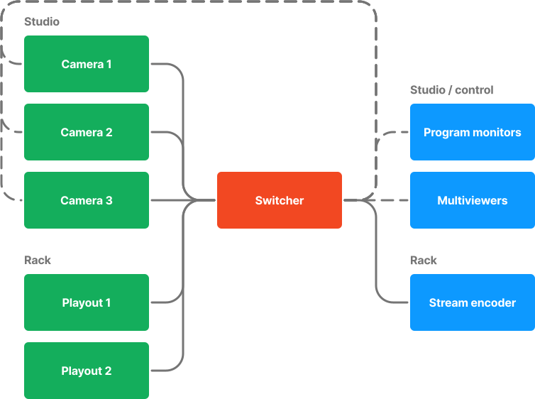
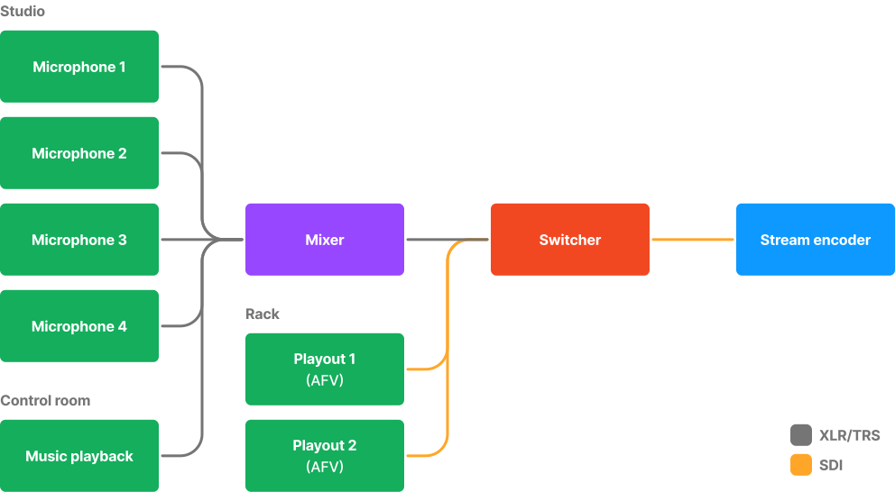

+++
title= "System wiring"

[extra]
tocEnable= true
+++

Overall, the production system is made up of four different categories of wiring—video, audio, the control plane, and power.

## Video

### Logical

Put short, the signal chain flows from inputs to outputs, with processing done in the middle of the chain.

Input devices—such as cameras and playout systems—are all routed into the switcher for processing and live switching. After the switcher, a program feed is sent to multiple destinations: the stream encoder and program monitors placed around the studio and control room. Program feeds are also sent back to each camera for the purposes of on-camera program monitoring and camera control, which is embedded into an SDI channel.

In addition to the main program feeds, special multiviewer feeds are sent to monitors in the control room for the Technical Director to use while switching. An additional multiviewer feed is spent to the studio for talent to monitor.

### Physical

On the physical level, connections are made using a combination of **12G-SDI** and **3G-SDI**, depending on the purpose. Systems which are 4K-capable should be running on 12G-SDI—such as the cameras, media playout systems, and the output to the stream encoder. Otherwise, 3G-SDI should be used to save on cost for the high number of confidence monitors and multiviewers.

In addition, if a video feed is going to a physical display, a bi-directional 3G-SDI to HDMI converter is used in the chain.

A combination of cable lengths are used—systems internal to the rack (switcher, playout, encoder) rely on short patch cables in order to reduce the amount of wasted cable. Systems outside of the rack (cameras and monitors) will use longer cables.

### Diagram

*Wiring diagram for all video feeds—solid lines indicate 12G-SDI connections and dashed lines indicate 3G-SDI connections.*

## Audio

### Logical

Inputs such as studio microphones and external music playback are all patched into our mixer. A final output is then sent into the switcher, where that audio and incoming audio from the playout systems are combined on the switcher's internal mixer. This is where the video and audio signal chains converge into one feed, and is output to the stream encoder for broadcasting.

Playout systems utilize audio-follows-video (AFV) functionality on the switcher's internal mixer, avoiding the need for monitoring an additional mixing interface outside of the physical mixer in the control room.

Control room monitors are available for both the switcher and mixer, being plugged into each respective device. For talkback, the mixer routes audio from a microphone to a small speaker in the control room.

### Physical

All connections up to the switcher are analog, being made using XLR and TRS cables.

Incoming connections from the studio are routed through a patch panel—located on the shared wall between the studio and control room. From here, they are routed into the mixer. These connections are made in parallel to the incoming music feed, connected via a 3.5mm-to-XLR cable. The mixer's output is then connected to the switcher's audio input, using a pair of XLR-to-TRS cables.

Post-switcher, the SDI connection to the stream encoder carries both the video and audio signals.

### Diagram

*Wiring diagram for all audio feeds—gren lines indicate XLR and TRS connections and orange lines indicate SDI connections.*

## Control plane

## Upgrades

## Quirks

## External resources