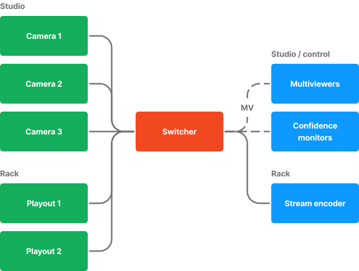

+++
title= "System wiring"
+++

Overall, the production system is made up of four different categories of wiring—video, audio, the control plane, and power.

## Video

### Logical

Put short, the signal chain flows from inputs to outputs, with processing done in the middle of the chain.

In our system, the cameras and playout systems serve as input devices. These inputs are routed into the switcher for processing and switching. After the switcher, clean program feeds are sent to the stream encoder and confidence monitors placed around the studio and control room. Clean feeds are also sent back to each camera for the purposes of on-camera program monitoring and camera control.

Alongside the clean output feeds, multiviewer feeds are sent to monitors for the Technical Director to use while switching.

### Physical

On the physical level, connections are made using a combination of **12G-SDI** and **3G-SDI**, depending on the purpose. Systems which are 4K-capable should be running on 12G-SDI—such as the cameras, media playout systems, and the output to the stream encoder. Otherwise, 3G-SDI should be used to save on cost for the high number of confidence monitors and multiviewers.

In addition, if a video feed is going to a physical display, a bi-directional 3G-SDI to HDMI converter is used in the chain.

A combination of cable lengths are used—systems internal to the rack (switcher, playout, encoder) rely on short patch cables in order to reduce the amount of wasted cable. Systems outside of the rack (cameras and monitors) will use longer cables.

*Wiring diagram of the video feeds for content—solid lines indicate 12G-SDI connections and dashed lines indicate 3G-SDI connections.*

## Audio

A similar system is in place for audio as well. Input feeds consist of microphones in the studio and music playback, all of which is patched into our external mixer. An output feed is sent out of the audio mixer and into the switcher, where it is combined with audio from the playout systems. The video and audio feeds combine here into one feed.

## Control plane

## Upgrades

## Quirks

## External resources